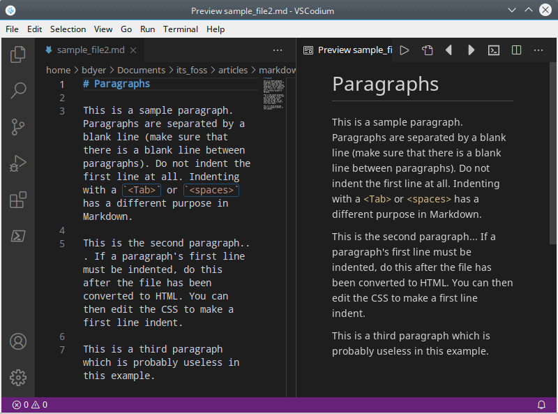
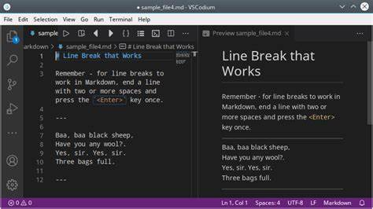
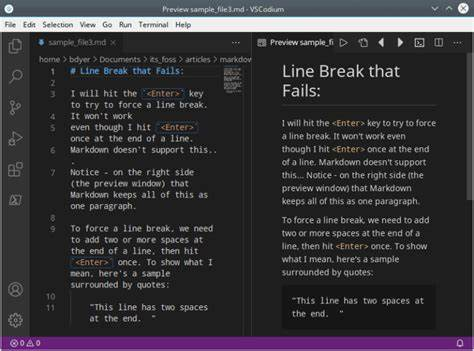
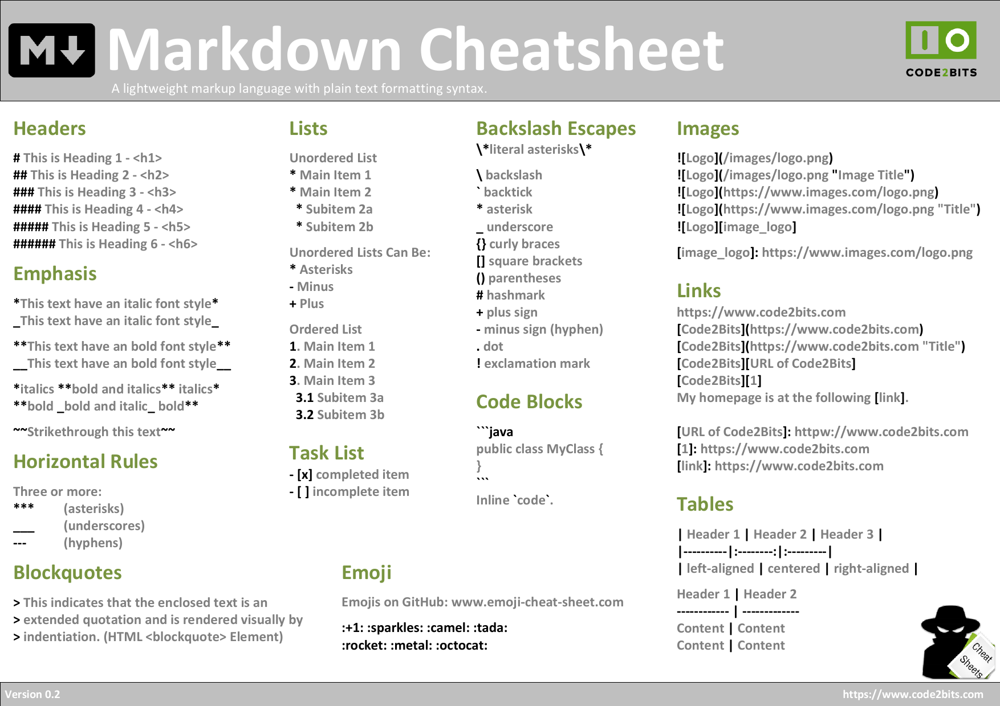

<a id = "table-of-content"></a>
# Table of Content

- [Table of Content](#table-of-content)
- [Introduction](#introduction)
- [Headings](#headings)
- [Paragraph](#paragraph)
- [Lists](#lists)
- [Line Break](#line-break)
- [Horizontal Rules](#horizontal-rules)
- [Emphasis on text with bold and italics](#emphasis-on-text-with-bold-and-italics)
- [Block quotes](#block-quotes)
- [Add links in markdown](#add-links-in-markdown)
- [Creating table](#creating-table)
- [Inline code](#inline-code)
- [Add image to Kaggle notebook](#add-image-to-kaggle-notebook)
- [Markdown cheatsheet](#markdown-cheatsheet)
- [References](#references)


<a id = "intro"></a>
# Introduction

Markdown is a lightweight markup language for creating formatted text using a plain-text editor. John Gruber and Aaron Swartz created Markdown in 2004 as a markup language that is appealing to human readers in its source code form. Markdown is widely used in blogging, instant messaging, online forums, collaborative software, documentation pages, and readme files. Read [more](https://en.wikipedia.org/wiki/Markdown)

In this work, I will only cover the syntax that are mostly used. These, I believe will be the most helpful.

Links use HTML to target your browser to that specific section of your Kaggle notebook. To see the inner workings and code, please fork this notebook and click on the cells to see the markdown 


<a id = "headings"></a>
# Headings

There are six levels. The  most common method is by typing # at the beginning of a line. The number of # denotes the level. On Kaggle, all level 1 headings will be automatically added under the table of content.
```
# Level 1 Heading
## Level 2 Heading
### Level 3 Heading
#### Level 4 Heading
##### Level 5 Heading
###### Level 6 Heading
```

Another method is the use of the <h> tag with a number indicating the level:
```
<h1>This is a level 1 heading</h1>  
```


<a id = "paragraph"></a>
# Paragraph
Paragraphs are created by inserting a blank line. To create a paragraph, the first line of a sentence is not to be indented. Indenting with a tab or spaces has a different purpose in Markdown.

  


<a id = "lists"></a>
# Lists

To create an ordered (numbered) list, just begin each line with a number.
1. Item one.
2. Item two.
3. Item three.

To create unordered list, use either an asterisk *, a plus sign +, or a minus sign - at the beginning of each item on the list.
* Item one.
+ Item two.
- Item three.

Sub-items can be added to both ordered and unordered lists by indenting.
1. Item 1
    1. Sub-item 1
    2. Sub-item 2
2. Item 2
    *  Sub-item 1
    *  Sub-item 2
3. Item 3  


<a id = "line-break"></a>

# Line Break
A line break is made by ending a line with two or more spaces and then hitting the `Enter` key once.  






<a id = "h-rules"></a>
# Horizontal Rules

These are great for splitting up text into sections. Use three or more dashes -, underscores _, or asterisks * for horizontal rules.  

---
The guy sitting there
***
is a programmer!
___

Note that using dashes with text on it  represent a pseudo-heading.
```
The guy
---
```

However, this is not a header

<a id = "emphasis"></a>
# Emphasis on text with bold and italics

To italicize a word or phrase, surround the text with one underscore or asterisk. To make a word or phrase bold, surround it with two underscores or asterisks:

This is *italics* made with asterisks.

This is _italics_ made with underscores.

This is **bold** made with asterisks.

This is __bold__ made with underscores.


<a id = "quotes"></a>

# Block quotes

Remember that block quotes are used for direct quotes.

> Use a single greater-than sign for a block quote.

>> Use two greater-than signs if you want a block quote that is further indented.

<a id = "link"></a>
# Add links in markdown

There are three ways to create links on basic Markdown: 
1. Regular links: Place the word to display in the square bracket [] and the actual link is inside parentheses ().  
Visit [Wikipedia](https://en.wikipedia.org/wiki/Markdown) today!
2. automatic links: The link is spelled out and, when it is converted to HTML, the spelled out link becomes a working link. <br> <https://en.wikipedia.org/wiki/Markdown>  
Emails are also linked like this <name@emailaddress.com>
3. Refrence links: This is use to link various parts in a page. Place the word to display in the square bracket [] and the actual link preceeded by # is inside parentheses (). <a id = "ref. text"></a>

```
To link an image, use the first method beginnig with a bang !
 
```


<a id = "table"></a>
# Creating table

* Start with a header row
* Use at least 3 dashes to separate the header cells
* Separate cells with a pipe symbol: |
* Outer pipes are optional

| S/N | First Name | Last Name|
|---|---|---|
|1 | Nurudeen | Abdulsalaam|
|2 | Your name | You got! |


<a id="inline-code"></a>
# Inline code

```
import pandas as pd

df = pd.read_csv("filepath)

df.head()
```  


<a id = "kaggle-image"></a>
# Add image to Kaggle notebook

- Drag and drop the image from folder containing the image directly from PC into the notebook. It will automaticaly generate a path that looks like this

```

```


- Use the html tag `img` to customize the image  


<a id = "cheat-sheet"></a>
# Markdown cheatsheet




<a id = "ref"></a>
# References
* What is [markdown](https://en.wikipedia.org/wiki/Markdown)
* Table [syntax](https://markdown.land/markdown-table)

Access on   
[](https://www.kaggle.com/code/nurudeenabdulsalaam/create-table-of-content-with-markdown)

[Back to top!](#table-of-content)